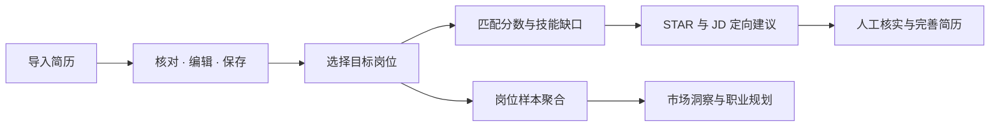
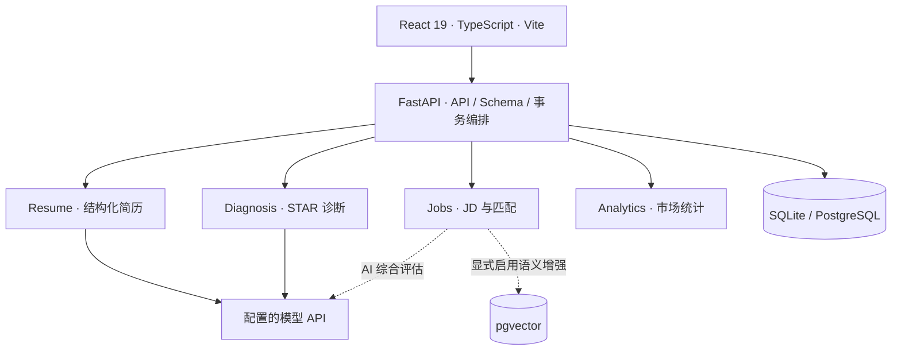

<div align="center">

# Vitae

### 从一份简历，到有依据的求职行动。

**AI 简历结构化 · 可解释岗位匹配 · STAR 定向优化 · 就业市场洞察**


[快速开始](#快速开始) · [产品能力](#产品能力) · [系统架构](#系统架构) · [开发与验证](#开发与验证) · [五人分工](T5_FIVE_PERSON_ALLOCATION.md)

</div>

---

Vitae 是一个本地运行的 AI 求职工作台，围绕「确认简历 → 选择目标岗位 → 理解匹配与能力缺口 → 针对岗位优化」组织完整流程。它保留简历原文和人工修改，把匹配依据、缺失技能与优化建议放在同一条工作链路中，帮助用户判断下一步该补充什么、突出什么。

项目对应课程 T5「AI 简历诊断与岗位匹配系统」，覆盖结构化编辑与关键词匹配、AI 诊断、就业市场分析三个层级。[严格需求对照表](T5_REQUIREMENTS_MATRIX.md)定义验收目标，实际验证结果见[验收台账](docs/acceptance.md)。

## 产品能力

| 工作区 | 可以做什么 | 设计重点 |
| --- | --- | --- |
| **我的简历** | 粘贴文本、导入 PDF / DOCX / TXT 或识别截图；核对结构化字段、编辑、保存与查看历史 | 保留原文；重解析保护人工编辑；保存形成可读回的版本 |
| **目标岗位** | 录入 JD 或从截图识别，整理技能、职责、学历、经验和薪资 | 识别结果先核对再保存；来源与原文可追溯 |
| **匹配分析** | 查看 0–100 关键词匹配分数、已匹配技能、缺失技能与可选 AI 综合评估 | 关键词基线可解释；向量增强需显式配置 |
| **AI 优化** | 按目标岗位生成 STAR 建议、关键词强化和量化补充提示 | 建议由用户核实；缺少事实时提示补充，不自动采用 |
| **市场洞察** | 技能词云、薪资与逐岗技能分布；按来源和日期筛选；桌面大屏展示 | 统计基于入库 JD，展示样本口径；支持同步外部岗位 |
| **模型设置** | 保存多份供应商配置，为不同功能分配模型，测试连接并持久化设置 | 用户自行提供密钥；缺少配置和模型失败明确反馈 |



### 为什么这样设计

- **编辑与 AI 分工明确。** AI 负责提取和建议，用户负责确认事实；解析失败后仍能保留输入、编辑并显式重新运行。
- **结果能够解释。** 关键词匹配给出命中与缺失项，语义能力作为增强；市场图表保留来源、日期和缺失值口径。
- **本地部署路径完整。** 源码启动使用 SQLite，另提供 PostgreSQL + pgvector 接入与 Windows 便携包构建方式。
- **验证覆盖业务边界。** 公共契约、事务、模块行为与前端流程分别检查，离线测试与真实模型验证分别留档。

## 快速开始

### Windows 便携版

获取已构建的便携包后，解压完整 `Vitae` 文件夹，双击 `Vitae.exe`。在侧栏 **设置** 中新建模型配置、填入自己的 API Key、测试并保存，再勾选要使用的功能。最终用户无需安装 Python、Node.js、Git 或 uv。

程序默认打开 [本地工作台](http://127.0.0.1:8000/)。请保留 `_internal` 等完整目录，并解压到可写位置；数据库位于包内 `data/t5.db`，模型设置位于 `.runtime/ai-settings.json`。移动整个目录可保留数据与配置。8000 端口被占用时需要先解决占用再启动。

参阅[用户上手说明](docs/windows-quickstart.txt)与[便携版构建及验证记录](docs/windows-portable.md)。

### 从源码启动

准备 Python **3.11–3.13**、Node.js **22+**（含 npm）、Git 和 [uv](https://docs.astral.sh/uv/getting-started/installation/)。

```powershell
git clone https://github.com/eonewg/t5-resume-match.git
cd t5-resume-match
Copy-Item .env.example .env
powershell -ExecutionPolicy Bypass -File .\start.ps1
```

启动后访问 [http://127.0.0.1:8000/](http://127.0.0.1:8000/)，交互式 API 文档在 [/docs](http://127.0.0.1:8000/docs)。首次启动会准备依赖并构建缺失的前端产物；修改前端后使用 `./start.ps1 -RebuildFrontend`，更换端口使用 `./start.ps1 -Port 8001`，按 `Ctrl+C` 停止服务。

未配置密钥也能启动界面；使用 AI 前，在设置页保存配置，或在 `.env` 填写 `DEEPSEEK_API_KEY`。仓库启动模板使用 DeepSeek 官方地址与 `deepseek-flash`；实际可用模型由所选供应商决定。不同功能的协议支持见 [AI 设置说明](docs/ai-settings.md)。

<details>
<summary><strong>其他系统 / 手动启动</strong></summary>

先复制 `.env.example` 为 `.env`，再执行：

```sh
uv sync --locked
npm --prefix frontend ci
npm --prefix frontend run build
uv run --locked python -m uvicorn backend.main:app --host 127.0.0.1 --port 8000
```

默认创建 `data/t5.db`，重启保留已保存记录，不自动录入样例。Vite 热更新开发见[前端接入说明](docs/frontend-integration.md)。

</details>

<details>
<summary><strong>常用配置与数据位置</strong></summary>

| 配置 | 默认值 / 用途 |
| --- | --- |
| `T5_DATABASE_URL` | `sqlite:///data/t5.db`；PostgreSQL 见[数据库指南](docs/postgres.md) |
| `DEEPSEEK_API_KEY` | 共享模型密钥，默认空 |
| `T5_RESUME_LLM_API_KEY` | 可选，覆盖简历识别密钥 |
| `T5_MATCHING_API_KEY` | 可选，覆盖匹配综合评估密钥 |
| `T5_DIAGNOSIS_API_KEY` | 可选，覆盖 AI 诊断密钥 |
| `.runtime/ai-settings.json` | 设置页保存的本机配置，包含密钥；不提交 Git、不放入便携分发包 |

设置页分配的配置优先于启动配置；恢复启动配置不改写 `.env`。完整变量见 [.env.example](.env.example)。

</details>

## 系统架构

React + TypeScript 负责页面与交互，FastAPI 提供同源 API 和静态资源服务。四个业务模块通过公开 provider、Pydantic Schema 与 ports 接入公共层；公共层负责持久化、事务和输出校验。



| 层次 | 技术与职责 |
| --- | --- |
| 前端 | React 19、TypeScript、React Router、Vite；页面、共享状态与 API 客户端 |
| 服务端 | Python、FastAPI、Pydantic v2、SQLAlchemy 2、Uvicorn |
| 数据 | SQLite 默认本地存储；PostgreSQL + pgvector 支持向量空间、索引与迁移 |
| AI | 按模块配置供应商；结构化输出校验与事实保护；支持范围以模块契约为准 |
| 工程 | uv / npm 锁定依赖、pytest、Ruff、Vitest、Playwright、GitHub Actions、PyInstaller |

```text
backend/
  api/ · core/ · schemas/ · models/    公共接口、配置、事务与数据模型
  modules/
    resume/                           简历解析
    jobs/                             JD、关键词匹配与语义增强
    diagnosis/                        STAR 与定向优化
    analytics/                        岗位样本统计
frontend/src/                         React 页面、交互状态与样式
tests/ · frontend/tests/              后端、前端与浏览器验证
scripts/                             启动、构建、迁移、数据导入与检查
examples/                            明确标注的合成样例
data/                                样本与评估材料；本地数据库被 Git 忽略
docs/                                架构、契约、协作与验收证据
```

更多设计见[架构说明](docs/architecture.md)、[API 契约](docs/api-contract.md)和[数据库与 pgvector](docs/postgres.md)。

## 开发与验证

在安装依赖后执行以下检查。前端先构建，供完整后端测试使用；这些命令本身不表示当前版本已通过全部真实环境验收。

```powershell
npm --prefix frontend run build
uv run --locked pytest -q
uv run --locked ruff check backend tests scripts examples
uv run --locked ruff format --check backend tests scripts examples
node scripts/check_frontend.mjs
npm --prefix frontend run test:e2e
```

浏览器验收使用隔离服务与本机 Edge，AI 为离线替身。真实服务冒烟可运行 `uv run --locked python scripts/smoke.py`，它会创建记录并调用当前配置的 AI，需单独准备可用服务和密钥。PostgreSQL、模型质量与全新安装分别依据对应记录判断。

Windows 开发机构建便携版：

```powershell
powershell -ExecutionPolicy Bypass -File scripts/build_windows.ps1
```

产物位于 `dist/Vitae/`，以完整目录分发。详细检查与条件见[便携版文档](docs/windows-portable.md)。

## 五人职责分工

按照系统实际模块划分五个工作包，A 承担更多跨模块架构、数据库、工程与集成责任。比例是**计划工作量权重**，用于分配和复核，不作为历史贡献统计。

| 成员 | 主要职责 | 计划权重 |
| --- | --- | ---: |
| **A · 总架构与集成负责人** | 总体设计、公共 API / 数据库、前端公共壳、配置、CI、集成与交付 | **35%** |
| **B · 简历工作台负责人** | 简历解析、字段保护、编辑保存、历史与文档导入 | **18%** |
| **C · 岗位与匹配负责人** | JD 管理、关键词评分、gap、语义增强与匹配评估 | **18%** |
| **D · AI 诊断负责人** | STAR、JD 定向建议、事实保护与模型失败恢复 | **16%** |
| **E · 市场分析与质量负责人** | 市场样本、统计图表、数据口径、系统测试组织与验证汇总 | **13%** |

具体代码范围、交接关系与验收标准见[五人分工方案](T5_FIVE_PERSON_ALLOCATION.md)。成员以 A–E 占位；姓名与实际完成项由成员确认后填写，历史提交和验证记录保留原始归属。

## 使用边界

- 面向本地单用户、桌面浏览器使用，当前验收宽度为 1280 / 1366 / 1440 / 1920 px；没有登录和多用户隔离设计。
- 数据保存在本机；使用 AI 时，相关文本或主动提交的截图会发送给配置的模型服务。AI 结果需要人工核实。
- 默认 SQLite；切换 PostgreSQL 不会自动搬迁已有 SQLite 数据。语义增强默认关闭。
- 市场洞察反映已采集样本，不代表整个就业市场；外部岗位记录不保证仍在招聘。
- 模型请求失败会明确返回错误，不静默伪装为 Mock 成功。`/ready` 不验证模型密钥有效性或输出质量。

## 文档导航

| 我想了解 | 文档 |
| --- | --- |
| 产品要求与演示 | [T5 需求](T5_REQUIREMENTS_MATRIX.md) · [演示脚本](docs/final/demo-script.md) · [合成样例](docs/demo-samples.md) |
| 部署与模型 | [Windows 上手](docs/windows-quickstart.txt) · [AI 设置](docs/ai-settings.md) · [Provider 配置](docs/current-provider.md) |
| 工程设计 | [架构](docs/architecture.md) · [API 契约](docs/api-contract.md) · [前端接入](docs/frontend-integration.md) |
| 团队分工 | [五人分工](T5_FIVE_PERSON_ALLOCATION.md) · [团队约定](docs/team-rules.md) · [开发上手](docs/team-onboarding.md) |
| 验证依据 | [验证记录](docs/validation.md) · [验收台账](docs/acceptance.md) · [交付状态记录](docs/final/delivery-status.md) |

验收材料按记录时间和提交版本理解；历史截图、模型配置和测试数量不自动代表当前版本。
